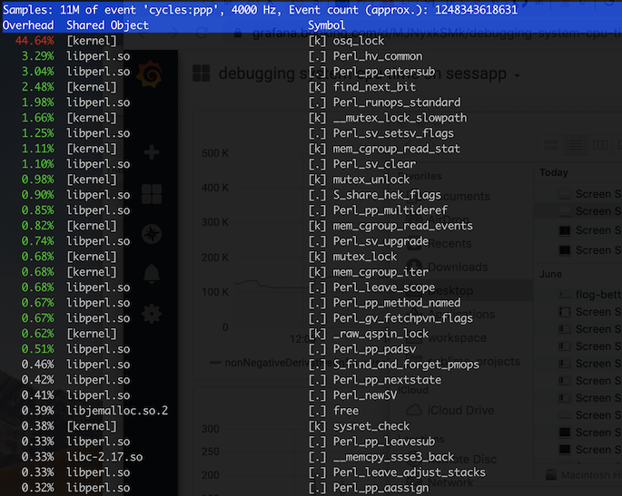
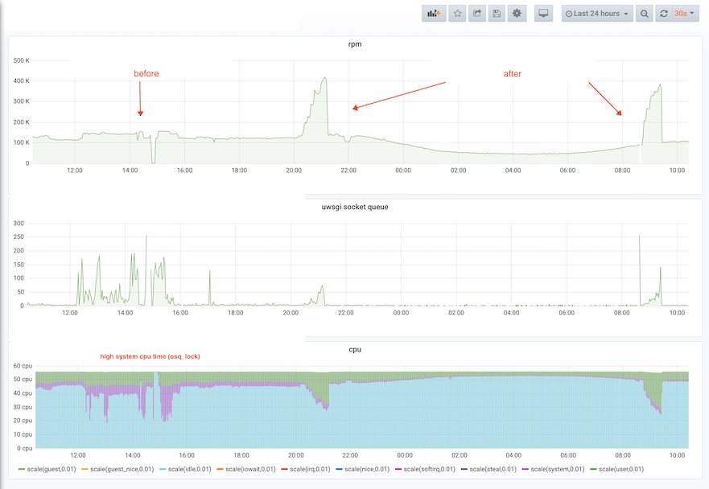

# Debugging kernel cpu time with luck, unwinding perl stack with bpftrace

(originally posted within the company at AUGUST 20, 2020, this is an edited version.)

* TLDR 1: with luck (aka booking.com experience/knowledge), bpftrace, perf, and pstack, some kernel/system cpu time was reclaimed in one of our high traffic perl system (restoring our service capacity from 150k rpm to 400k rpm).
* TLDR 2: now we have a way/hack of bpftrace script to unwind perl stack triggered by a kern func.
* TLDR 3: it’s worth investing in ebpf and bpftrace(+perldtrace). :D

Recently we are getting some capacity issues for our session system, so I started taking a closer look on it. One thing that caught my eyes quickly was that there were some high system cpu time on the servers, especially noticeable when it’s under heavy load. So I started looking at the cause.

## sudo perf top



So it’s fairly straightforward that osq_lock was a lock and there was contention on it. We had our first clue.

## bpftrace kstack and ustack

Next, I wanted to see what’s the kernel and userspace stack looks like, bpftrace is one way to go (yes, I was constantly look for chances to enhance my bpftrace skills):

```
sudo bpftrace -e '
kprobe:osq_lock {
	@calls[kstack, ustack] = count();
}

interval:s:3 {
	print(@calls);
	clear(@calls);
	exit();
}
'
```


So from the kstack, we could see that it’s related to reading cgroup memory stats.
Unfortunately, sometimes ustack in bpftrace doesn’t work well. I did’t know how the read in userspace is triggered. However, the read function call is still a lead. So I turned to gdb.

(`sudo perf top -g` can also do the job here though.)

## pstack (gdb)

This was somewhat a brutal step, I simply looped over all the uwsgi processes and run pstack over them one by one. And based on the `read` func that I got in last step, this is what I found. (However, this was mostly a blind guess that I’m making, and this was my first luck)

```
#0  0x00007f5a5444c75d in read () from /lib64/libpthread.so.0
#1  0x00007f5a5090d13f in PerlIOUnix_read () from /usr/lib64/libperl.so
#2  0x00007f5a5090d47d in PerlIOBuf_fill () from /usr/lib64/libperl.so
#3  0x00007f5a50909ea8 in Perl_PerlIO_fill () from /usr/lib64/libperl.so
#4  0x00007f5a5090ce91 in PerlIOBase_read () from /usr/lib64/libperl.so
#5  0x00007f5a5090cfa3 in PerlIO_getc () from /usr/lib64/libperl.so
#6  0x00007f5a508a509c in Perl_sv_gets () from /usr/lib64/libperl.so
#7  0x00007f5a5088b609 in Perl_do_readline () from /usr/lib64/libperl.so
#8  0x00007f5a50884fda in Perl_runops_standard () from /usr/lib64/libperl.so
#9  0x00007f5a508be15a in S_docatch () from /usr/lib64/libperl.so
#10 0x00007f5a50884fda in Perl_runops_standard () from /usr/lib64/libperl.so
#11 0x00007f5a50805ed2 in Perl_call_sv () from /usr/lib64/libperl.so
#12 0x00007f5a50caf7a9 in uwsgi_perl_after_request () from /usr/lib64/uwsgi/psgi.so
#13 0x000000000041a357 in uwsgi_close_request ()
#14 0x000000000045ed4d in simple_loop_run ()
#15 0x000000000045eb5e in simple_loop ()
#16 0x00000000004630c4 in uwsgi_ignition ()
#17 0x000000000046655d in uwsgi_worker_run ()
#18 0x0000000000466b4f in uwsgi_run ()
#19 0x000000000041674e in main ()
```

uwsgi_perl_after_request was a good lead here, it tells us that it’s something that’s happening after a request was processed.

Still, this information only told me that it’s some perl codes that was triggering the syscall that leaded to lock contention. I needed to figure out what is perl code.

## Luck

With all these information, I already had a vague idea of what might be going on. However, I didn’t know good enough about the code that might be triggering the issue, which meant that I didn’t have a good keyword to search it. And it’s tricky to obtain perl stacks on production. One way to do it is to inject perl script with gdb, but it requires intercepting the perl process and injecting some perl codes, what's more, only triggers the perl stacktrace dump when osq_lock is hit, which is in kernel, and it isn't trivial.

bpftrace does allow us to run a script when osq_lock is triggered, however, there is no simple way to acquire perl stacktrace that I know of.

In [my last post](/bpftrace/perldtrace.html), I was talking about using bpftrace and perldtrace, But at that point in time, I hadn’t figured a way to unwind perl stack triggered by a kernel func. But I got lucky by using a shitty bpftrace script that gave me the promising keywords and then we were able to make a fix.

this bpf scripts only prints out the call count of perl subroutines

```
usdt:/usr/lib64/libperl.so:sub__entry {
        @start_ts[arg3, arg0, arg2] = nsecs;
        @calls['$pid', str(arg3), str(arg0), arg2] = count();
}

kprobe:osq_lock {
        print(@calls);
        clear(@calls);
}
```

system cpu time and request rate before/after



## Unwinding perl stack with bpftrace without luck

Even though our problem of the kernel lock is resolved, I don’t like counting on luck for finding the root cause. So with some tinkering, I managed to work out a script and it’s able to reliably unwinding perl stack when a osq_lock is triggered. And it looks like this:

```
pid=`ps -eo pcpu,pid,cmd | grep uwsgi | sort -nr | sed 's/^ \+//' | sed 's/ \+/ /' | cut -d ' ' -f 2 | head -1`

echo "tracing $pid"

sudo BPFTRACE_STRLEN=64 bpftrace -p $pid -e '
usdt:/usr/lib64/libperl.so:sub__entry {
        @depth++;
        @module[@depth] = str(arg3);
        @sub[@depth] = str(arg0);
        @line[@depth] = arg2;
}

usdt:/usr/lib64/libperl.so:sub__return {
        @depth--;
}

kprobe:osq_lock {
        if (pid == '$pid' && @line[@depth-0] > 0) {
                printf("\n");
                printf("%s %s %d\n", @module[@depth-0], @sub[@depth-0], @line[@depth-0]);
        }
}

kprobe:osq_lock {
        if (pid == '$pid' && @line[@depth-1] > 0) {
                printf("%s %s %d\n", @module[@depth-1], @sub[@depth-1], @line[@depth-1]);
        }
}

kprobe:osq_lock {
        if (pid == '$pid' && @line[@depth-2] > 0) {
                printf("%s %s %d\n", @module[@depth-2], @sub[@depth-2], @line[@depth-2]);
        }
}

kprobe:osq_lock {
        if (pid == '$pid' && @line[@depth-3] > 0) {
                printf("%s %s %d\n", @module[@depth-3], @sub[@depth-3], @line[@depth-3]);
        }
}

END { clear(@module); clear(@sub); clear(@line); }
```

Two notable points:

* pid check: because osq_lock could be triggered  by other uwsgi processes, so we only want to print the stack when it’s triggered by our worker
* stacks are maintained by a simple bpf map indexed by a simple depth counter, we can’t join strings easily in  bpftrace at the moment (I hate the 512 bytes of stack limit), so we need to save modules and subs in two different maps.

With this script, it reliably tells us which perl function is triggering the kernel lock, now when a similar situation/issue presents itself, we have more control.
