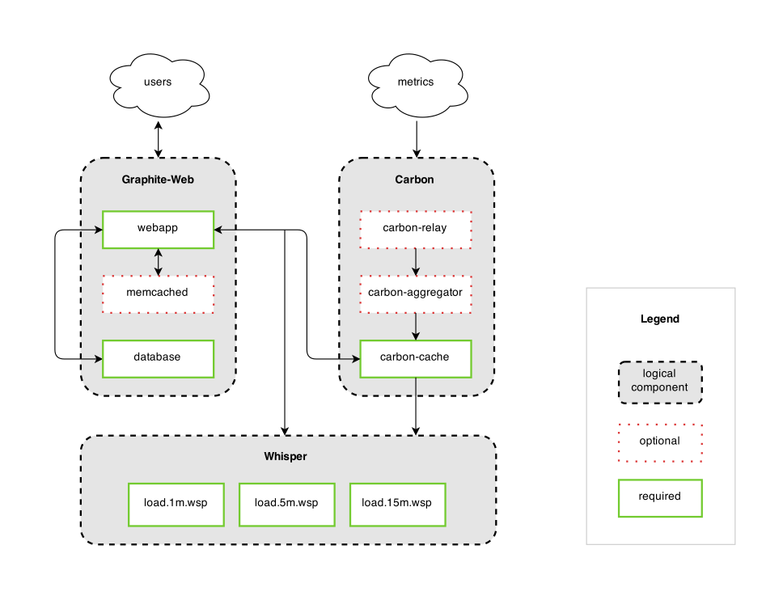
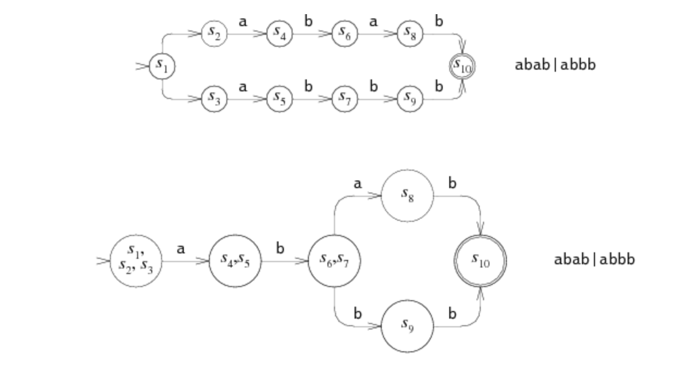

# Scaling go graphite stroage stack

---

# Disclaimer

---

# What is Graphite

Graphite is a time-series database. It was originally written in python (mainly), the whole tool consists of multiple components like:

- frontend carbon api for returning timeseries data or graphite-web for rendering graph
- relay (for scaling and duplicating data)
- storage: carbon and whisper
- admin tooling: buckytools

---

copy from https://github.com/graphite-project/whisper

---

# Graphite at Booking

No longer a vanilla setup, various components are being rewritten (some more than once), for example:

- [carbonapi](https://github.com/bookingcom/carbonapi), rewritten by [Damian Gryski](https://github.com/dgryski), [Vladimir Smirnov](https://github.com/Civil) and many others.
- relay is now [nanotube](https://github.com/bookingcom/nanotube) written by Roman Grytskiv, Gyanendra Singh and Andrei Vereha from our Graphite team, (it was preceded by [carbon-c-relay](https://github.com/grobian/carbon-c-relay) written by [Fabian Groffen](https://github.com/grobian))
- [go-carbon for storage](https://github.com/go-graphite/go-carbon), written by [Roman Lomonosov](https://github.com/lomik)

My story today is mainly about the storage program: go-carbon.

---

# Graphite Metric

* An example graphite metric: `sys.app.host-01.cpu.loadavg`
* An example graphite retention policy: `1s:2d,1m:30d,1h:2y`
	* size of the retentoin example: (86400*2 + 1440*30 + 24*730) * 12 = 2,802,240 bytes
	* 1s:2d is called an archive (same for 1m:30d and 1h:2y)

---

# What is Whisper

In graphite, each metric is saved in a file, using the a round-robin database format, named whisper.

* This means that given a random timestamp and a target archive, we can infer its location in the whisper file, which means is programmably trivial to support out-of-order data and rewrite.
* In whisper file, each data point has a fixed size of 12 bytes (4 bytes for timestamp, 8 bytes for value and yes, one more thing to fix before 2038).

---

# What is Gorilla compression

---

# The core of the efficient algorithm

* Delta encoding for timestamps
	To be presice, it's actually the delta of delta
* XOR for values
	Built on the assumption that timeseries data tend to have contstant/repetitive values, or values fluctuating within a certain range, this means that XOR with the previous value often has leading and trailing zeros, and we can only save mostly just the meaningful bits

---

# Best case Example

| # | Timestamp  | Value  |
|---|---|---|---|
| #1 | 1598475390  |  0 |
| #2 | 1598475391  |  0 |
| #3 | 1598475392  |  0 |
| #4 | 1598475393  |  0 |
| ... | ...  |  0 |
| #100 | 1598475493  |  0 |

With the compression algorithms introduced in the gorilla paper, orther than the first two data points, the rest of them could be compressed with 2 bits.

---

# How to comibine Gorilla and Whisper

A new file format needs to be designed from scratch in order to compress data points using the gorilla algorithm.

---

# CWhipser (Compressed Whisper)

* Still a round robin database
* File size isn't fixed (would grow/extend over time)
* Archives are split into many blocks (ideally consist of 7200 data points per archive)
* No longer data point addressable (means hard to support rewrite and limited out-of-order range)

---

# Result

---

# Globbing graphite metrics

---

# Using Standard library

Pro: Simple

Con: High performance cost in a large file tree (millions of files)

Glob is a userspace implementation, so it first needs to ask the kernel returning all the files and then glob over it.

---

# Using Trigram

Originally implemented by Damian Gryski.

TLDR: it breaks downs all the metrics as trigrams, and maps the trigram to the metrics (an inverted index). A glob query is also convert as a trigrams, then intersects the metric trigrams and query trigrams, then it would use the glob to make sure the files match the query.

Pro: faster than standard library (no syscalls after index, and file list are cached in memory)

Con: index is expensive to build when dealing higher number of metrics (above 5 millions or more).

Minor: corner cases like if part of the metric name has one or two chars, need to use filepath.Match to double check if files are really matched, etc.

---

# What is trie, NFA/DFA

(copy from https://swtch.com/~rsc/regexp/regexp1.html)

---

# The new index solution

TLDR: index all the metrics in go-carbon instance with trie, compile the glob queries first as nfa (then dfa during walking). And walking over the trie and nfa/dfa at the same time.

Pro:

* faster index time
* less memory usage
* no standard library fallback
* better/predictable performance

Con:

* Certain types of queries are faster using trigram (like foo.*bar.zoo, because of the leading star, the new index algorithm needs to travel the whole namespace, however, arguably, you can design your metric namespace properly to avoid this issue)

---

# Result

---

# Production and Community usage status

Challenges on rolling out Compressed Whisper

* Out of order
* Rewrite

Trie+NFA/DFA index solution is being used

---

# Restropection
