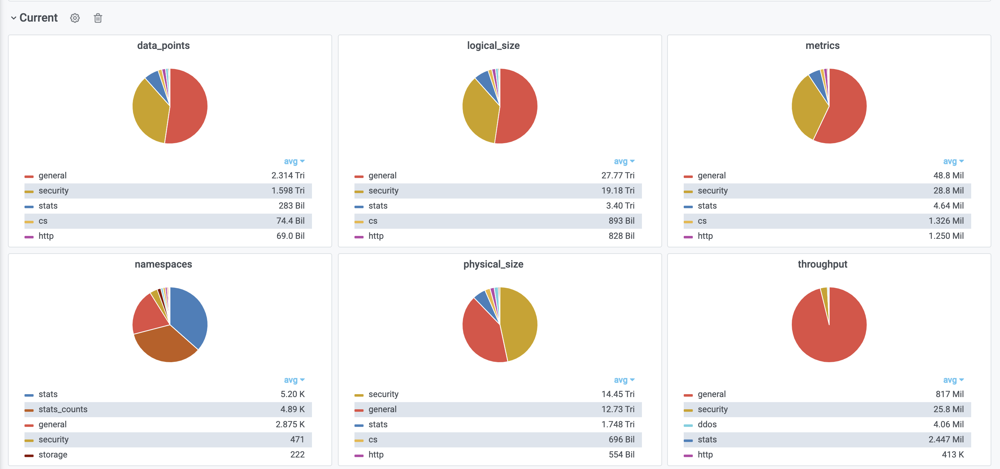
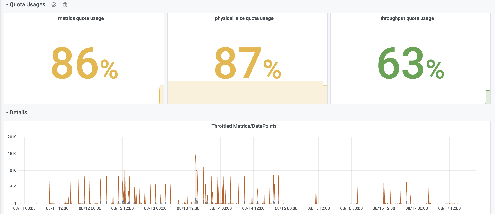

# Graphite Quota/Usage: metrics of metrics

This is mostly about an reability improvement in the Graphite storage running at Bookign.com: [Go-Carbon](https://gitlab.booking.com/graphite/go-carbon).

---

# What is Graphite and Graphite at Booking.com

Graphite is a timeseries database. An example of metric path: `sys.app.cpu.usage.user`.

Some numbers:

* 400 millions uniq metrics (stale metrics are being constantly pruned)
* 700 TB of disk usage
* 1000+ query requests per second

---

# WHY

To keep Graphite the system alive where there are "unscheduled" metric growth or bugs that produces high amoutn of metrics.

---

# HOW

Overall idea: maintaining the usage on the directory nodes on the its trie index, whenever metrics are being sent to the system, Go-Carbon/Graphite would check if it's a new metric and if there is quotas left for its matching rules in the system.

The devils are in the details.

---

# HOW

There are 6 controls available: `throughput`, `physical-size`, `logical-size`, `metrics`, `namespaces`, `data-points`.

---

# An example

```
[*]
metrics       =      1,000,000
throughput    =     60,000,000
physical-size = 50,000,000,000 # 50GB

[/]
metrics       =      10,000,000
throughput    =     600,000,000
physical-size = 250,000,000,000 # 250GB
```

---



---



---

# WHERE

For now, we are just looking at enabling it on root level.

But the usage of various namespaces/prefixes that are being collected to give us great visibility on them.

If needed, we can quickly enable throttling on the targeted namespaces.

---

# Bonus

Go built-in hashmap is much faster than my hand-bake trie tree traversing.

It actually saves us 5 CPU cores when it comes to throughput throttling.

In highsight, this is common wisdom as hashmap has o(1) lookup.
