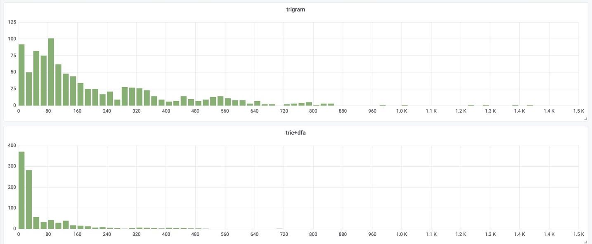
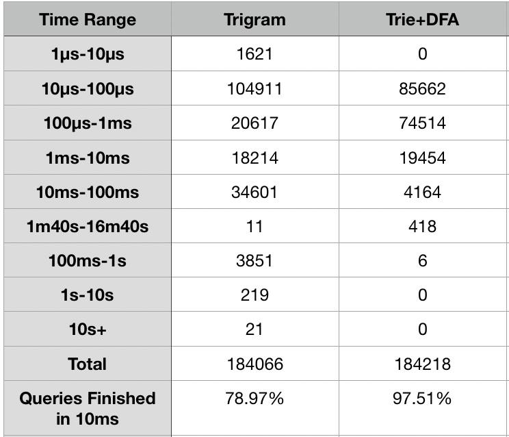
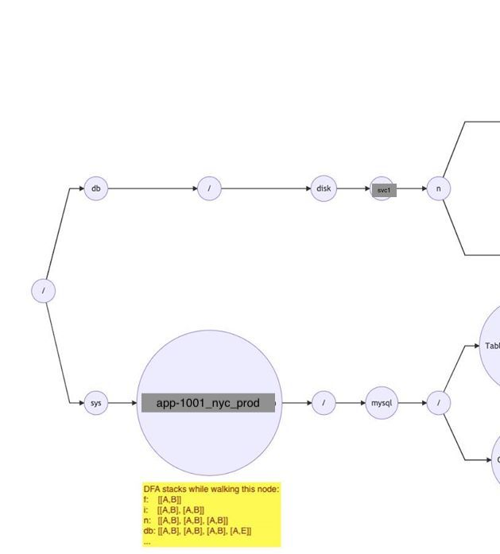

# To glob 10M metrics: Trie * DFA = Tree² for Go-Carbon (the graphite storage node daemon)

(originally written at October 9, 2019)

Table of Contents

TLDR: By combining Trie and DFA for indexing metric paths, letting two trees walking over each other, this new implementation halves the memory usage of go-carbon process (avg 57% less, from 20.5G to 8.8G) and reduces 99th percentile of render request time to 1/2 - 1/5 of it with trigram index on go-carbon. This is making us a one step closer to having wholly cwhisper-powered clusters!

## [Short context](#short-context)

Metrics are saved as files on go-carbon (one file per metric), the graphite storage daemon.

When we make a query to Graphite, like general.tuning.minutely.sys_stats.{extranet,xydapi}.host.prod.*.*.stat.cpu.all.idle.mean, before go-carbon fetches data from file, go-carbon needs to figure out what files to read from. Using filepath.Glob (a golang stdlib function for globbing files) is getting expensive when you have millions of metrics (too many syscall). The current go-carbon is using trigram indexing with filepath.Glob as fallback for fetching, which also has performance issues when metrics number rise above 10 millions.

So we develop this new algorithm by using trie and dfa that has shown good potential in our tests.

## [Live test](#live-test)

Tested on a cwhisper cluster replica, with 9 servers in total

* Metrics count per node is ~3M
* 5 nodes using trie+dfa, 4 nodes using trigram (graph below is using data of 4 nodes for each indexing type, i.e. the count of request should be the same)
* With production traffic

Displaying data bellow with histogram to show the advantage of the new implementation (With trie+dfa, most of the 99th percentile request time is under 50ms (it's a histogram with x-axis being 99th request time in millisecond):



## [Non-Live Test](#non-live-test)

With queries and metric names collected from production, displaying data bellow with histogram to show the advantage of the new implementation:



From the non-live test, we could see that trigram index is able to finish 57% of the queries under 100us, but  has a longer tail, comparing to Trie+DFA.

## [The problem (more details)](#the-problem-more-details)

In our previous test of cwhisper (a compressed version of file format for storing Graphite metrics) on one of our graphite clusters, Alexey Zhiltsov noticed that 99th percentile of request time on cwhisper nodes (5M - 6M metrics per node) were worse than whisper clusters, because of  higher number of metrics served per box. And cwhisper makes it feasible for us to serve 10M metrics per box. So speeding up the request would make cwhisper deployment even more attractive.

Then we started a discussion from which I learnt about some of the drawbacks of the current indexing implementation trigram:

* https://github.com/lomik/go-carbon/issues/202
* https://github.com/lomik/go-carbon/issues/301

Therefore, I started an attempt to try out some "new" ideas, which ended up leading me to the new implementation of combining trie and DFA.

## [How trigram index works](#how-trigram-index-works)

This index is implemented by ex-Bookinger Damian Gryski, to make an unfairly simple explanation (because it’s a post about the new index ;) ): it works by generating trigrams from a metric path and then using them to build an inverted index (trigrams -> metric paths). When querying is sent to go-carbon, it would also generate trigrams based on the queries, and  then intersect both sets of trigrams to filter out metrics.

## [How trie+dfa index works](#how-trie-dfa-index-works)

A "very inaccurate" description of the algorithm (reading source code is better):


```
1. Metric paths saved on go-carbon are indexed using compact trie (key for space efficiency)
2. Queries are broken down into multiple NFA by "." (e.g.: abc.efg*.xyz -> abc$, efg*$, xyz$)
3. Generating DFA while depth-first walking on the trie generated in #1 (current trie node is the root)
  a. Walk over every children of the current trie node, go to step b if matched is found on DFA; otherwise go to step e;
  b. Push the current DFA state and trie node to a stack, go to step a
  c. If end ($) of the last DFA, and a leaf or "." in the index trie are reached, collect the metric;
    c0. Continue with step a if DFA could be continued with current childen trie nodes, otherwise step c1;
    c1. Pop one dfa state, continue to the next sibling (go to step a) if there is, otherwise step c2;
    c2. Pop one dfa state, going back to parent trie node, go to step a;
  d. Switch to next NFA if "." is reached, continue to step a;
  e. Continue to next children if there is, otherwise pop DFA state and trie node off the stack. Exit if all is empty.
```

The main data structures:

* Trie (static and being replaced until next full disk scan every $configurable minutes)
* An array of NFA states and a stack of DFA states (generated on every query) (The DFA implementation is mainly inspired/copied/modified from Russ Cox’s post here: https://swtch.com/~rsc/regexp/regexp1.html)

A simple and also not so accurate illustration of the metric trie tree, NFA&DFA:

A NFA for the second node of query sys.{,*[0-9]}app{m,r,}db-**_{prod,dev}_svc.mysql:


A Trie sample with a DFA stack annotation:



## [Pros](#pros)

* Less memory usage and faster index time
* Better "empirical" performance
* Easier to write a performant query (a bit stretch though ;)
* More scalable, can handle 10M metrics
* More globbing syntax could be extended relatively easier
* No filesystem globbing fallback

## [Cons](#cons)

* Some queries with leading star in queries might be slowed down (from milliseconds to seconds), example:

```
svc.group.*.*.haproxy.server.*app-*_prod.weight (notice *bookadmin part)
```

Solution to this issue is either take the hit as long as the slow down isn't too bad or rewrite the query to make it performant if possible (by removing the leading star with {}; for instance, the example query could be rewritten as: ``svc.group.*.*.haproxy.server.{,pre1,pre2}app-*_prod.weight`).

Full pull request you are interested in all the details: https://github.com/lomik/go-carbon/pull/303/files
